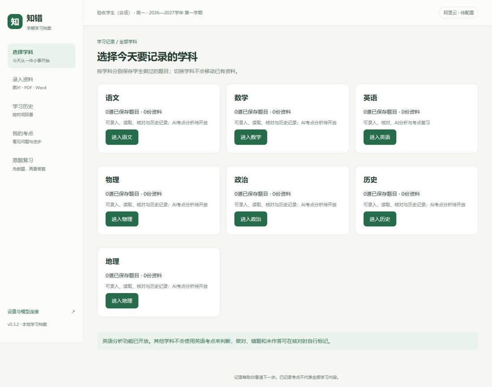
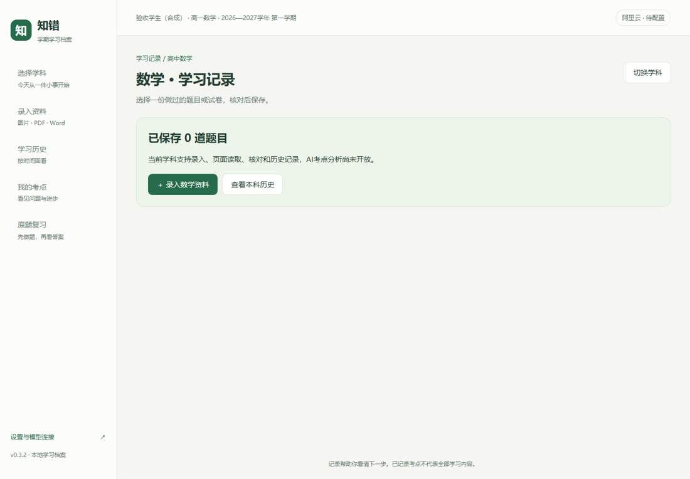
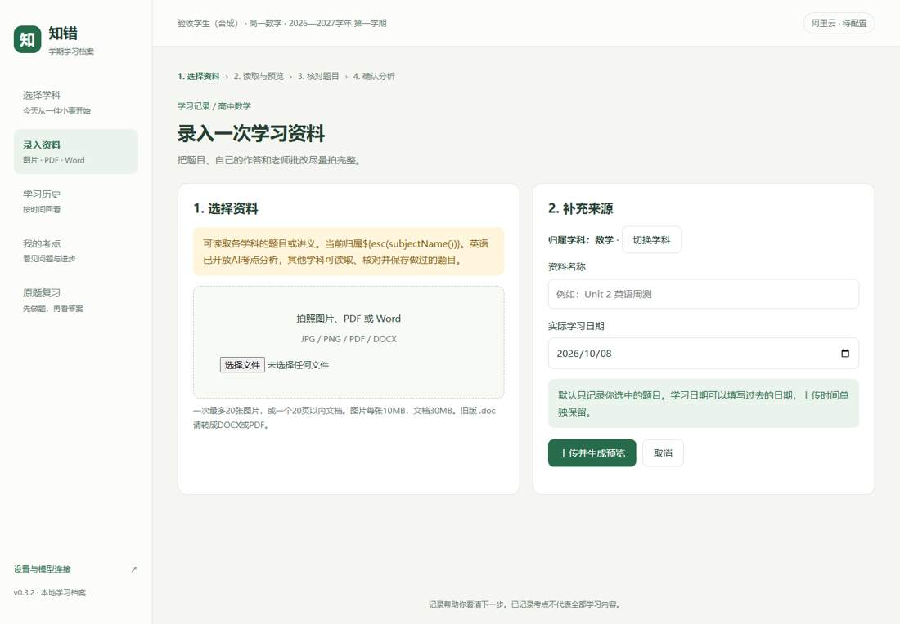
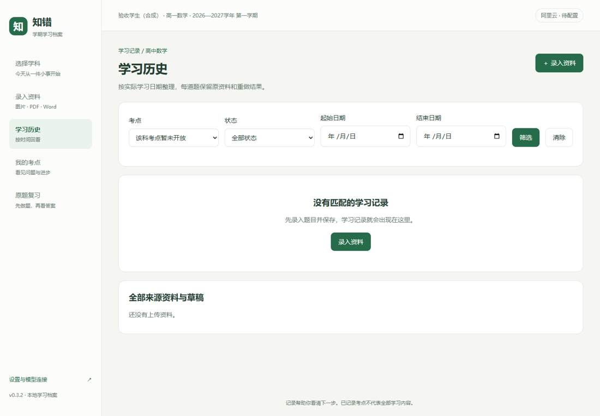
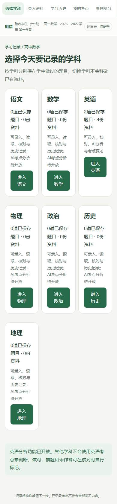

# v0.3.2 产品需求文档

日期：2026-10-08。目标：稳定交付可在本地验证、可继续迭代的高中错题记录软件。单学生、单当前学期、七科记录，英语优先分析。

## 范围与主流程

P0：学习档案 → 选科 → 上传资料 → 预览/识别 → 人工核对 → 英语分析与确认 → 保存历史 → 考点证据 → 原题复习 → 结果记录。其他六科提供录入、识别、核对与历史，分析与自动复习待开放。讲义识别成功但没有习题时展示文字，可手动补题，不反复提示图片模糊。

P1/P2：其他学科考点库、云同步、多人账号、新题生成等沿用功能清单中的后续范围，本版不实现。

## 业务规则

- 学科按资料保存，切换学科不移动数据。化学、生物不出现在入口。
- AI 为建议；缺少实际作答不得推断个人错因，阅读原文/选项缺失及作文评分依据缺失时保持待确认。
- 题目版本或知识库变化后，旧分析失效；旧数学分析不能重新确认为英语分析。
- 保存、确认和复习分别记录；只有确认且可核对的错题进入复习候选。
- 提示与揭示答案持久化；重做结果自动保存，暂停后继续。删除题目同时清除重做快照中的原题内容。
- 原题复习证据不等同于掌握全部同类题。重复点击提交不得重复记录。
- 密钥与真实学生数据保存在本机；公开截图仅含合成样例。
- 快速路由切换后，旧页面请求不得覆盖当前页面。

## 逐页原型与操作

以下为本版真实界面截图，使用合成资料。错误或空状态显示明确原因、重试/返回入口；长任务分转换、识别与分析阶段显示。

### 建立档案

填写昵称、年级、教材及学期日期；保存后选科。

### 选择学科

七科学科卡片显示本科记录数量；进入所选科工作台。

### 空工作台

引导上传或导入固定示例；示例明确标识非真实 AI。

### 学习工作台

查看记录、待确认分析及复习进度，进入上传、历史、考点或复习。

### 录入资料

选择图片、PDF 或 DOCX，填写名称与日期，确认学科；多图片可排序、移除。

### 读取与预览

分别显示转换、识别状态；可预览原页、重试失败任务或进入核对。

### 核对题目

逐题修正题干与实际作答，标记未作答、对错及选择状态；先核对再分析。

### 确认分析

呈现解法、作答证据、错因和考点；有疑问保留待确认，可修改后保存。

### 历史记录

按时间、学科及筛选条件查看已保存题目与资料，进入详情。

### 题目详情

显示原题、作答、分析、考点、重做证据；可查看原资料、重做或删除。

### 考点轨迹

英语考点按章节显示已确认题目与错题；未记录不等于未学习。

### 考点证据

查看关联原题及重做结果，安排针对性原题复习。

### 复习计划

筛选已确认、有作答且答案可靠的原错题，选择数量并开始；可继续未完成计划。

### 资料详情

查看原文件预览、题目与任务状态，可继续核对或删除整份资料。

### 独立重做

初始不返回答案与检查提示；纸上完成后核对，可暂停并继续。

### 核对重做

核对标准答案，选择独立做对、提示后做对或仍有错误；用过提示不能记独立做对。

### 复习结果

统计实际完成结果，未完成题不算错误；跨两次且间隔至少24小时独立做对才作为验证证据。

### 设置

更新学期档案、配置或清除加密密钥、测试模型连接；不回显密钥。

### 其他学科工作台

显示本科记录；自动考点分析与复习暂未开放。

### 其他学科上传

资料归属本科，上传后核对原题和作答。

### 其他学科历史

只显示本科资料，不混入英语题目。

### 手机界面

同一流程采用单列布局，页面不得横向溢出。

## 验收标准

接口测试通过；完整浏览器流程通过；图片/PDF/DOCX 可预览；七科隔离；暂停继续有效；答案隐藏与提示保护有效；手机无横向溢出；公开仓库不含密钥、数据库与学生实际记录。详细结果见 ACCEPTANCE.md。
